# 使用LoRA微调多模态Florence2模型

## 纺织布匹瑕疵
从真实布匹厂采集数据：

<p align="center">
    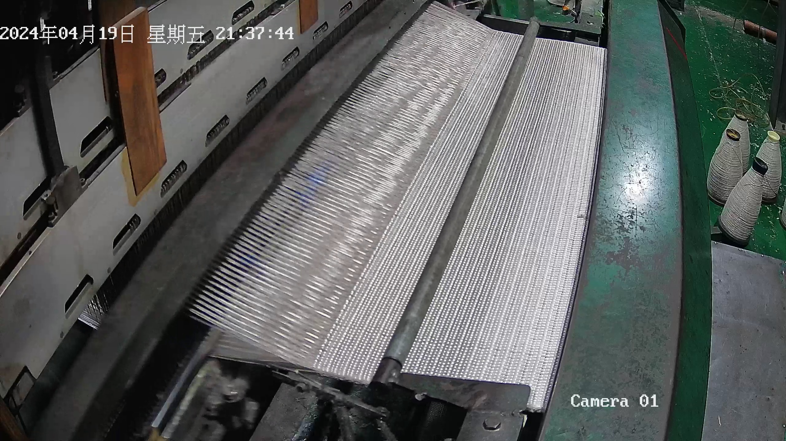
<p>

## 布匹瑕疵
1. 工厂生产过程中会出现断针，从而导致布匹表面出现各种瑕疵
2. 将瑕疵分为`wrinkle`,`drop`,`broken`三类

这里布匹数据由于私有原因，只放出几张图片

## 模型架构
<p align="center">
    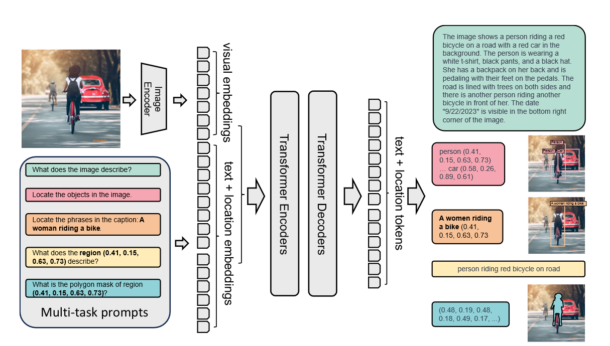
<p>


- 模型以图像和文本prompt作为输入，最后输出文本格式。
- 利用DaViT视觉编码器将图像转换为token embeddings，与由BERT生成的文本embeddings进行拼接，最后通过模态编码解码器进行处理，以生成响应结果
- Florence-2系列包含两个模型：Florence-2-base和Florence-2-large，分别拥有0.23亿和0.77亿个参数。

## 数据处理
1. 使用`Labellmg`标注布匹瑕疵
2. 将标注格式转换为Floren2接受的格式
```angular2html
将标注数据先归一化（通过除以图像分辨率，将值缩放为0到1之间的浮点数），然后乘以1000并四舍五入为整数。
最终，x1, y1, x2, y2的值是在0到999的闭区间内的整数。

具体格式：
{"prefix":"<OD>","suffix":"drop<loc_732><loc_481><loc_748><loc_501>","image":"0 (1).jpg"}
{"prefix":"<OD>","suffix":"drop<loc_252><loc_481><loc_268><loc_501>drop<loc_667><loc_464><loc_682><loc_481>","image":"flipped_0 (1).jpg"}

`<OD>`为任务类型的特俗Token，`drop`为瑕疵类型，<loc_732><loc_481><loc_748><loc_501>为对应坐标

```

3. 标注数据中选择对应的特殊token标注，如`<OD>`为目标检查任务，`<DENSE_REGION_CAPTION>`为区域caption生成任务

## 使用LoRA微调

<p align="center">
    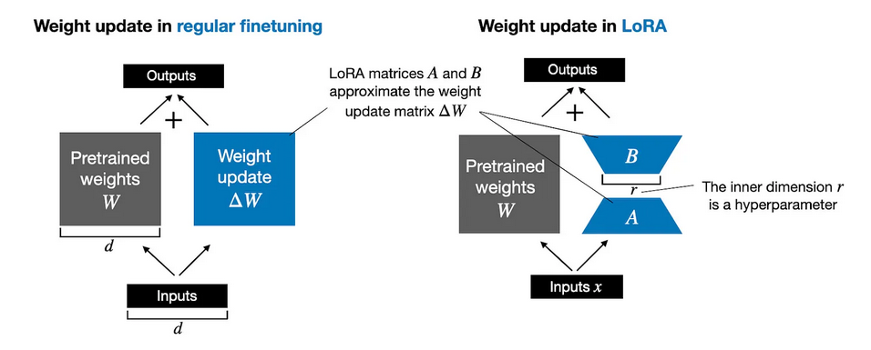
<p>

Florence2应用Lora可以使用在`q_proj`, `out_proj`, `k_proj`, `v_proj`, `linear`, `Conv2d`, `lm_head`, `fc2`, `fc1`
这些层中，一般选择应用在`q_proj`, `k_proj`, `v_proj`。但具体应用哪些层需要逐步去实验，以达到最佳效果。这里训练我选择`q_proj`, `k_proj`, 
`v_proj`，`lm_head`, `fc2`, `fc1`层

训练时实验发现：
- 在多次实验中，发现一般`alpha`为`r`的两倍会达到比较好的效果，`r`控制LoRA矩阵的大小，`alpha`控制LoRA的应用程度

- 微调时设置r为 8、16、32、256，r越大，参数矩阵越大，训练越慢，但模型损失却没有明显下降

- 训练时可以选择只训练文本编码器，冻结视觉编码器，但多次实验发现将文本编码器和视觉编码器一起训练效果会比冻结的好

- 训练数据的构成顺序也有关系，由于我的训练数据里包含`OD`、`DENSE_REGION_CAPTION`、`CAPTION_TO_PHRASE_GROUNDING`，这三种数据的混合顺序对损失也有影响，相同设置下，训练顺序为`OD`、`DENSE_REGION_CAPTION`、`CAPTION_TO_PHRASE_GROUNDING`会有较到损失

- 训练收敛速度快，3-4回合就收敛

### 实验结果

实验设置
单卡3090、epoch=10、r=8、alpha=16、lr=1e-6、模型均无冻结、使用Florence-2-base

训练集：2672,，测试：540

<p align="center">
    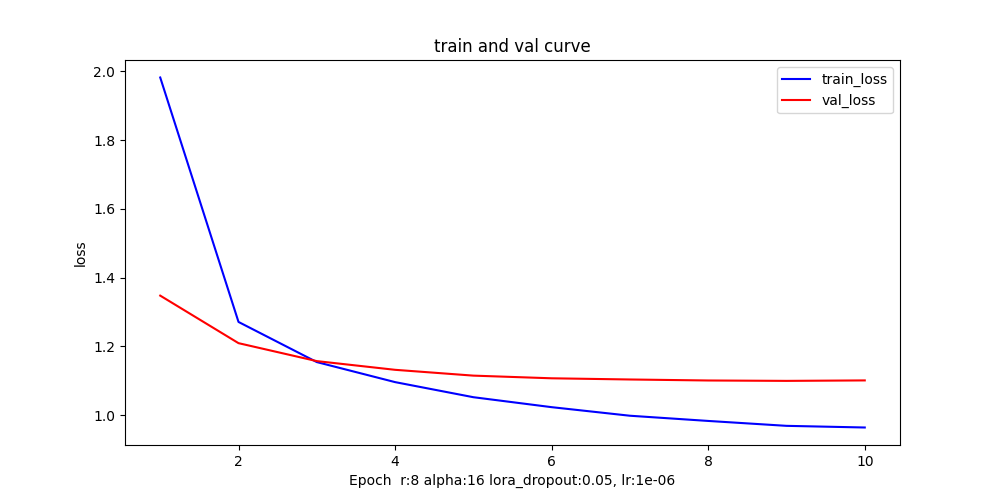
<p>
在epoch=3是损失收敛

学习率过大时损失会发散
lr = 3e-6
<p align="center">
    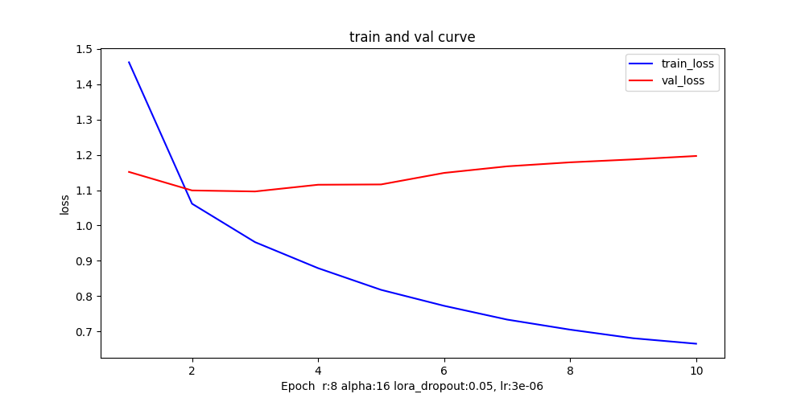
<p>

lr = 5e-6
<p align="center">
    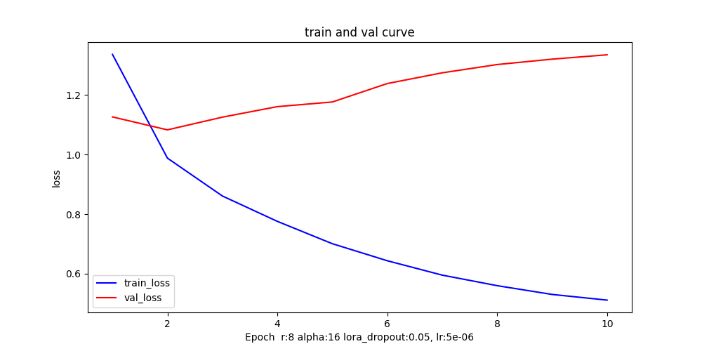
<p>

语义分割，输入`broken-weft`

| 输入图像or文本or图像+文本                                               | 输出 bbox or 文本                                                 |
|---------------------------------------------------------------|---------------------------------------------------------------|
| 语义分割，输入`broken-weft`                                          |                                                               |
| <p align="center">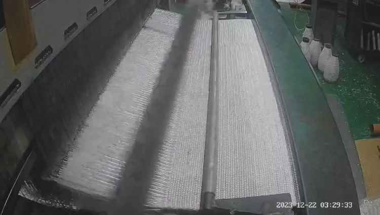<p> | <p align="center">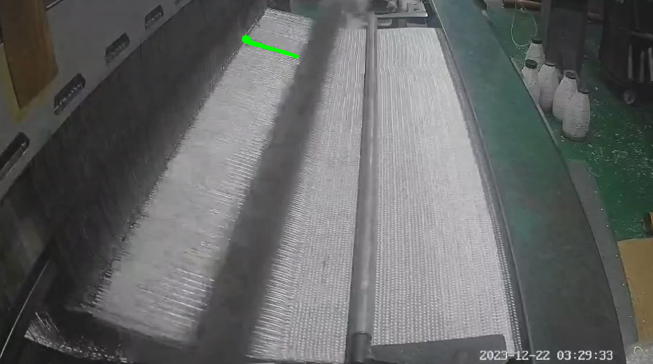<p> |
| 输入图片做目标检测                                                     |                                                               |
| <p align="center"><p> | <p align="center">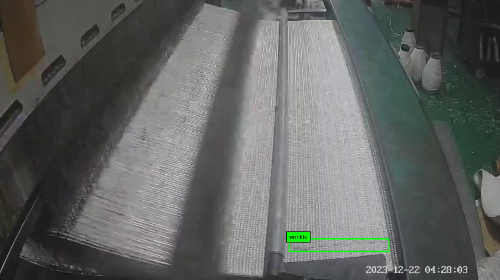<p> |
输入图像生成caption                                                                                                            
<p align="center"><p>
Caption:

```
fabric with wrinkle-weft. The fabric is laid out on a green cutting mat. There are various tools and materials scattered around thefabric. The image appears to be taken in a workshop or studio
```


| 目标检测测试结果                                                      |                                                               |
|---------------------------------------------------------------|---------------------------------------------------------------|
| <p align="center">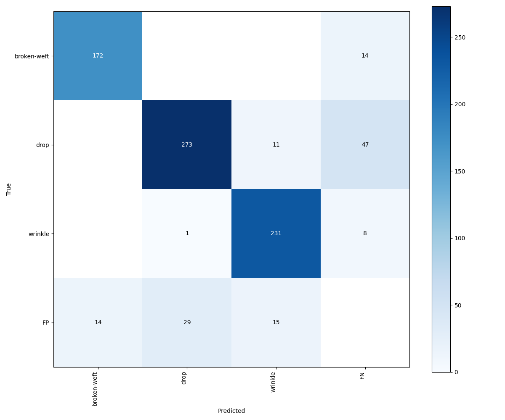<p> | <p align="center">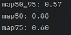<p> |


gradio界面
<p align="center">
    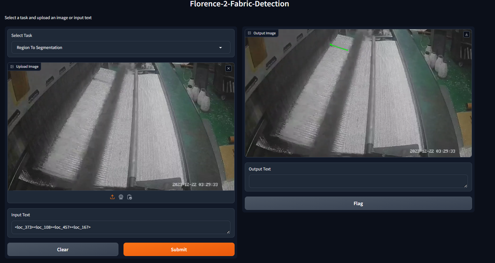
<p>

### 参考
[How to Fine-tune Florence-2 for Object Detection Tasks](https://blog.roboflow.com/fine-tune-florence-2-object-detection/#florence-2-dataset-format)

[Improving LoRA: Implementing Weight-Decomposed Low-Rank Adaptation (DoRA) from Scratch](https://magazine.sebastianraschka.com/p/lora-and-dora-from-scratch)
